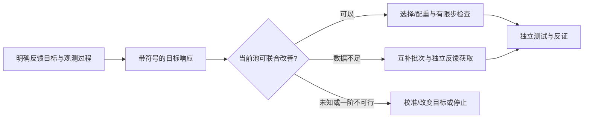

# LLM4Rec Research Lab — Complementary Learning from Data

**面向多目标LLM推荐的数据选择、互补学习与证据获取。不是数据压缩项目。**

当前交付：研究与可执行参考实现；`2026-09-05`。目标仓库 `YWDDLiang/rec`。没有远端push，没有预训练模型权重或真实用户数据。

> **先读验证边界：** CPU数学/接口测试与合成训练已执行；tiny SFT并未稳定改善测试集，atoms提名没有额外效果。没有运行真实LLM/真实推荐benchmark/线上用户/湿实验。不能将这个仓库描述为已完成WWW论文实验或“十个idea全部证明有效”。

## 阅读入口

[完整研究主报告](docs/RESEARCH_REPORT_ZH.md) · [10方向与数学索引](docs/ideas/README.md) · [Idea 01：Joint Learning Opportunity](docs/ideas/01_joint_learning_and_complementarity.md) · [Idea 02：Behavioral Gradient Atoms](docs/ideas/02_personalized_atoms.md) · [Idea 11：预算条件行为选择](docs/ideas/11_budget_conditioned_behavioral_selection.md) · [数据丰富选择与数据混合](docs/landscape/05_data_rich_selection_and_data_mixture.md) · [新颖性碰撞](docs/matrices/novelty_collision_matrix.md) · [实际验证](docs/VALIDATION.md) · [严肃审计与修订](docs/AUDIT.md) · [实施规格](docs/IMPLEMENTATION.md) · [49项一手来源](references/README.md) · [下一位研究者交接](docs/HANDOFF.md)

## 核心问题

单个样本的总分可能为零，但两组数据分别补偿不同推荐目标时，组合可以创造新的联合学习机会。应区分当前目标没有共同下降方向、参数方向可行但当前数据不能提供、估计误差太大无法判断。研究重心从“删哪些重复”转向“哪些互补数据、在哪个阶段、以什么证据使模型更会推荐”。



## 运行CPU参考实现

建议Python 3.11及以上。本次实际测试环境为Python 3.13、PyTorch CPU；精确版本见[环境记录](results/environment.json)。

```bash
python -m venv .venv
# Linux/macOS: source .venv/bin/activate
# Windows PowerShell: .venv\Scripts\Activate.ps1
python -m pip install -e ".[test]"
python scripts/run_all.py
```

该命令运行测试、10方向数学示例、二次互补干预、3种子tiny SFT、3种子完整组分类RL，生成`results/summary.json`并检查文档链接。没有模型下载或外部付费调用。在线安装依赖本身需要网络；本次环境使用已经安装的依赖。

单独运行：

```bash
python -m pytest -q
python experiments/run_mechanisms.py
python experiments/run_complementarity.py
python experiments/run_tiny_sft.py --output results --steps 25 --seeds 0 1 2
python experiments/run_tiny_rl.py --output results --steps 80
python scripts/summarize_results.py
python scripts/validate_repo.py
```

## 可选真实模型入口（未在本次环境执行）

```bash
python -m pip install -e ".[hf]"
python scripts/train_hf.py --model /path/to/local/base_model --data /path/to/records.jsonl --output runs/hf_smoke --method frontier --steps 10 --pool-size 4 --reference-size 16 --gradient-filter feedback_head --device cuda
```

这是共享LLM主干的多反馈监督ranker，不是MiniOneRec官方复现。默认只在feedback_head子空间估计梯度，不能认证所有LoRA参数更新；`--gradient-filter ALL`有显式内存上限。单进程，不要用torchrun启动。HF依赖和本地权重均未在本次环境加载测试，见[实施边界](docs/IMPLEMENTATION.md)。

## 目录

```text
rec/
  src/rec_lab/       # 16个以上算法、数据与训练模块
  tests/            # 数学、概率、时间泄漏和训练接口测试
  experiments/      # 真正执行的参考实验
  scripts/          # 数据适配、HF入口、运行与验证
  configs/          # CPU复现实验配置
  docs/             # 10方向、领域调研、证明、审计、交接
  references/       # 49项来源，明确阅读证据等级
  results/          # 本次实际输出及失败记录
```

论文方法尚未定稿：01+06为候选主线；03是时序扩展；02 atoms降为可选；04是观测前提；05是RL扩展；07/08为独立探索/执行线；09/10为科学推荐应用。不是要求一篇论文同时塞入十个模块。

原始代码MIT许可；第三方模型、论文、数据遵循原许可，本库只提供引用，不包含其复制品。研究文档不是任何外部论文的官方实现说明。
